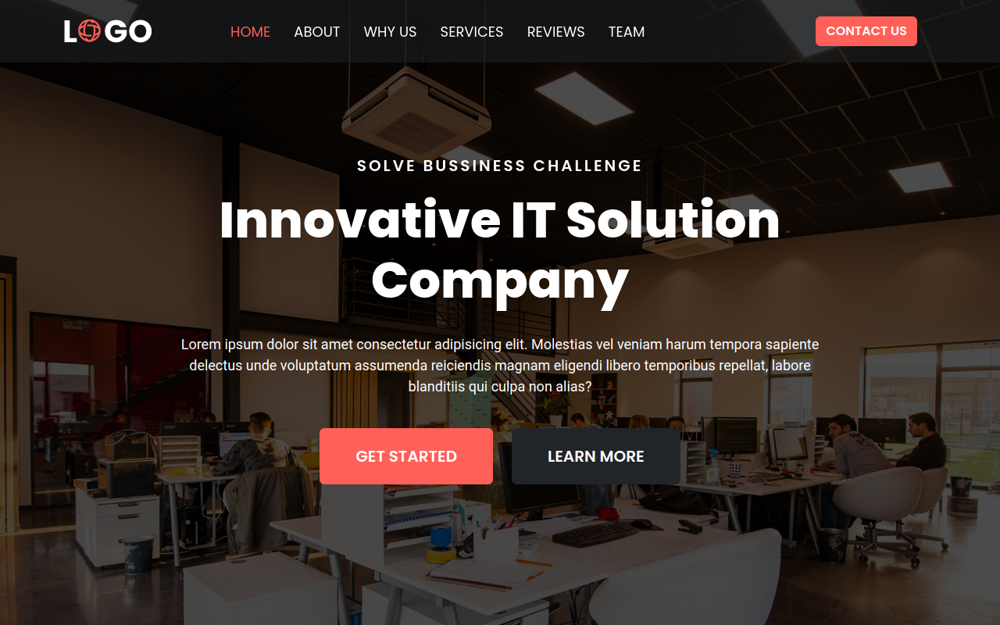

# IT-Solution - IT Services Website

## Overview

IT-Solution is a website designed for an IT services agency, showcasing various IT solutions and services. The project utilizes HTML, CSS, Bootstrap, and JavaScript to create a responsive and visually appealing website. Key functionalities include animated scrolling using Slick animation library, a testimonial auto-slider, and a hamburger menu for mobile devices.

### Table of Contents

- [Installation](#installation)
- [Usage](#usage)
- [Technologies Used](#technologies-used)
- [Features](#key-features)
- [Project Structure](#project-structure)
- [Credits](#credits)
- [License](#license)



## Installation

To run this project locally, follow these steps:

1. Clone the repository to your local machine.
    ```bash
    git clone https://github.com/ramzancodeclub/IT-Solution.git
    ```

2. Open the project folder in your code editor.

3. Open the `index.html` file in your web browser.

## Usage

To explore the IT-Solution project:

1. Open the [live demo](https://it-solution-mu.vercel.app/) or run it locally.

2. Scroll through the website to experience the animated elements, testimonial slider, and the hamburger menu on mobile devices.

## Technologies Used

- HTML
- CSS (Bootstrap included)
- JavaScript
- Slick Animation Library
- Bootstrap Icons

### Key Features

- **Scroll Animations:** Engages users with animated elements as they scroll through the website.
  
- **Testimonial Auto-slider:** Features an automated slider displaying client testimonials.

- **Hamburger Menu:** Enhances mobile user experience with a collapsible menu.

## Project Structure

The project is structured to highlight various IT solutions and services, incorporating animated elements for a modern and engaging user experience.

## Credits

I would like to acknowledge the following resources and tools that contributed to the success of this project:

- Bootstrap (https://getbootstrap.com/)
- Slick Animation Library (https://kenwheeler.github.io/slick/)

## License

This project is licensed under the [MIT License](LICENSE). Feel free to use and modify the code as per the license terms.

---

## Badges


## Feedback and Contributions

If you have any feedback or would like to contribute to the project, follow these steps:

1. Fork the project.
2. Create a new branch for your contribution: `git checkout -b feature-name`.
3. Commit your changes: `git commit -m 'Add new feature'`.
4. Push to the branch: `git push origin feature-name`.
5. Open a pull request.

## Contact

If you have any questions, suggestions, or just want to connect, feel free to reach out:

- Email: [ramzancodeclub@gmail.com](ramzancodeclub@gmail.com)
- Portfolio: [muhammad-ramzan.vercel.app](https://muhammad-ramzan.vercel.app/)
- LinkedIn: [in/ramzancodeclub](https://www.linkedin.com/in/ramzancodeclub/)

## Tests

The project includes a set of tests to ensure the functionality is working as expected. To run the tests, use the following command:
```bash
npm test
